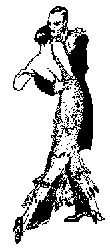

# Cyber - Tango - everything about Tango in the net

CYBER - TANGO
Argentinian Tango in the Internet
-------------------------------------------------

[www.cyber-tango.com](http://www.cyber-tango.com/e/)
© Garrit Fleischmann 1995-2009

Tango Argentino:

\[ [English](http://www.cyber-tango.com/e/tango_e.html) | [Deutsch](http://www.cyber-tango.com/tango.html) \]

[Read](art_e.html):

\[ [Bibliographies](art_e.html#biblio) | [Journals](art_e.html#journals) | [Lyrics](art_e.html#lyrics) | **[Mailing Lists](art_e.html#maillist)** |
**[Articles](art_e.html#articles)** | [Discussions on Tango-L](art_e.html#tangol) | [mixed topics](art_e.html#mixed) \]

[Dance](#dance):

\[ **Tango Geography: [Germany](deu_e.html), [USA](usa_e.html), [World](geo_e.html)** |
[Tango in Frankfurt](tangoffm_e.html) |
[Teacher](teacher_e.html) | [Festivals](#festivals) | [Travel](#travel) \]

[Music](musik_e.html#music):

\[ [Musicians](musik_e.html#orchestra) | [Bandoneon](musik_e.html#bandoneon) | [Listen](musik_e.html#listen) |
[Sheet Music](musik_e.html#sheet) | [Discographies](musik_e.html#disco) | [Order CDs](musik_e.html#order) \]

[Watch](#watch):

\[ [Art](#pictures) | [Movies](#movie) | [Video](#video) | [Shows](#shows) | [TV](#TV) \]

[Fashion](#fashion):

\[ [General](#generalfashion) | [Clothes](#clothes) | [Shoes](#shoes) | [Jewelry](#jewelry) \]

[Body](#body):

\[ [Movement](#movement) | [Feet](#feet) \]

[Argentina](#argentina):

\[ [Food & Beverages](#food) | [Learn Spanish](#spanish) | [Lodging](#lodging) | [Miscellaneous](#misc) \]

[Other Server](#other):

\[ [Europe](links_e.html#europe) | [America](links_e.html#america) | [General Dance Resources](#general) \]

[Service](service_e.html):

\[ [City maps](service_e.html#citymaps) | [Travel Infos](service_e.html#travel) | [Telefone](service_e.html#fon) | [Search Engines](service_e.html#search) | [Translate](service_e.html#translate) | [Currencies](service_e.html#currencies) | [Jokes](service_e.html##jokes) \]

* * *

_"El tango argentino es un pensamiento triste que se puede bailar"_
_"The tango argentino is a sad thought, which can be danced"_
Enrique Santos Discépolo

* * *

* * *

If you are interested in a banner on one of the pages, please send an email to: __

* * *
News in the World of Tango
--------------------------

*   Review at www.Britanica.com about Cyber-Tango.com
    The Web's Best Sites: Tango
    Cybertango
    Rating: \*\*
    Exzcellent set of links to everything about tango dancing on the Web. Covers books, journals, lyrics, dancers, teachers, music, discographies, compact discs, movies, videos, shows, and other materials.

* * *
